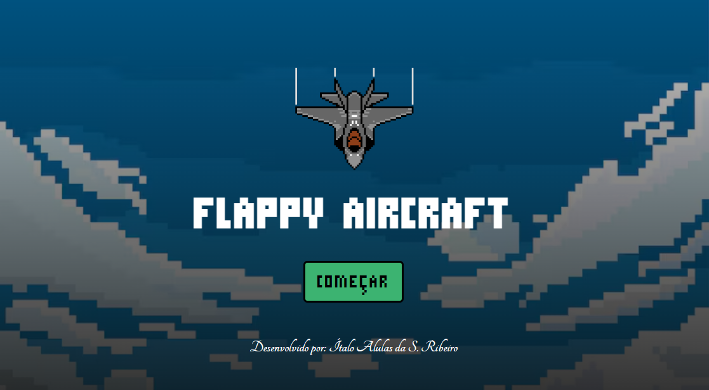

# ✈️ **Flappy Aircraft**

  
  

O Flappy Aircraft é o primeiro jogo que criei!
Foi inspirado no clássico Flappy Bird e desenvolvido do zero com HTML, CSS e JavaScript.

Este projeto me ajudou a consolidar as minhas habilidades em lógica de programação, manipulação do DOM e detecção de colisão.

---
## 🕹️ **Demonstração**

👉 [Jogar Flappy Aircraft](https://italoalulas.github.io/flappyAircraft/)

---
## ⚙️ **Funcionalidades**

- ✈️ Voo controlado por pressionamento de tecla.
- 🧱 Geração dinâmica de obstáculos.
- 🧮 Pontuação crescente conforme o jogador avança.
- 🔄 Reinício automático após colisão ao pressionar a barra de espaço.

---
## 🧠 **Aprendizados**

- Lógica condicional e laços aplicados em jogos.
- Manipulação direta do DOM com JavaScript.
- Implementação de colisões e movimento contínuo.
- Organização de código.

---
## 💬 **Considerações pessoais**

Apesar de singelo, o Flappy Aircraft representa um marco importante na minha jornada como desenvolvedor web.

Foi construído com dedicação, paixão e aprendizado genuíno, e espero evoluir cada vez mais para criar aplicações web mais elaboradas e completas no futuro.
